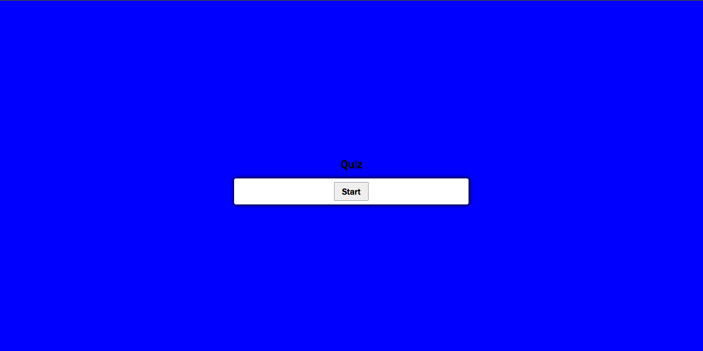

# QuikQuiz

## Description

This webpage is a quick and easy to use quiz on javascript that will even save your high score to a leaderboard. You can retake it as many times as you like and save as many scores as you like. This one has been a very big challenge to conquer.

## Installation

NA

## Useage

You can go to https://svensalyard.github.io/QuikQuiz/ and click start to begin a short and easy javascript quiz. At the end you can save your initials and score or restart.

## Credits

Websites: https://www.w3schools.com/jsref/met_win_setinterval.asp (for the timer)

https://www.sitepoint.com/simple-javascript-quiz/ (helped with some of the logic)

In class assignments and the mini project really helped to put together questions and scores.

## License

Please refer to the LICENSE in the repo.